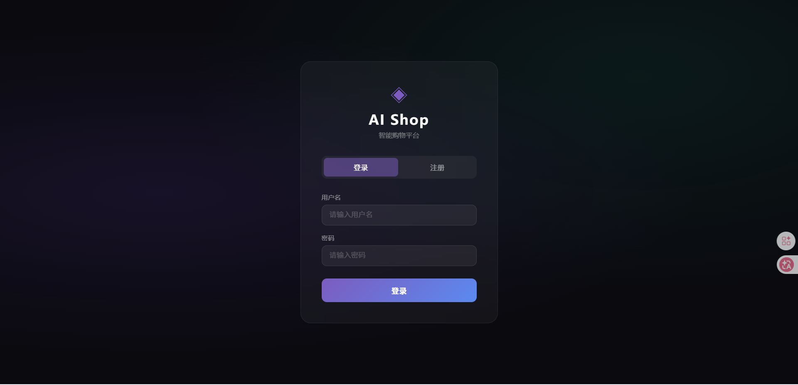
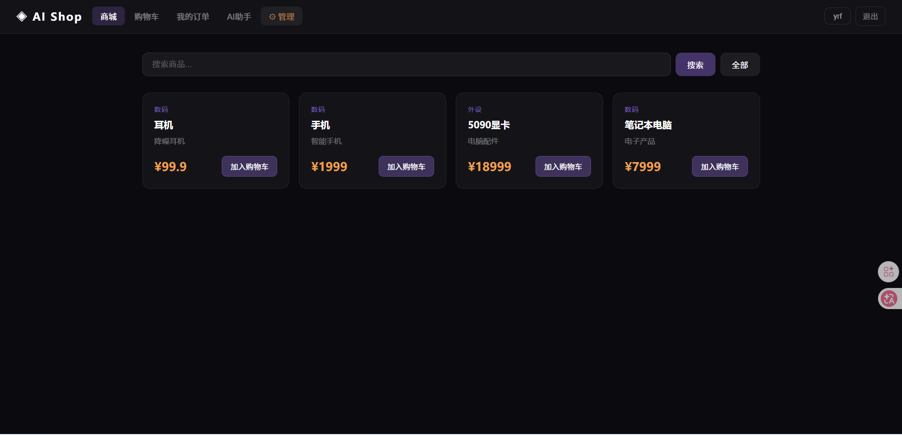
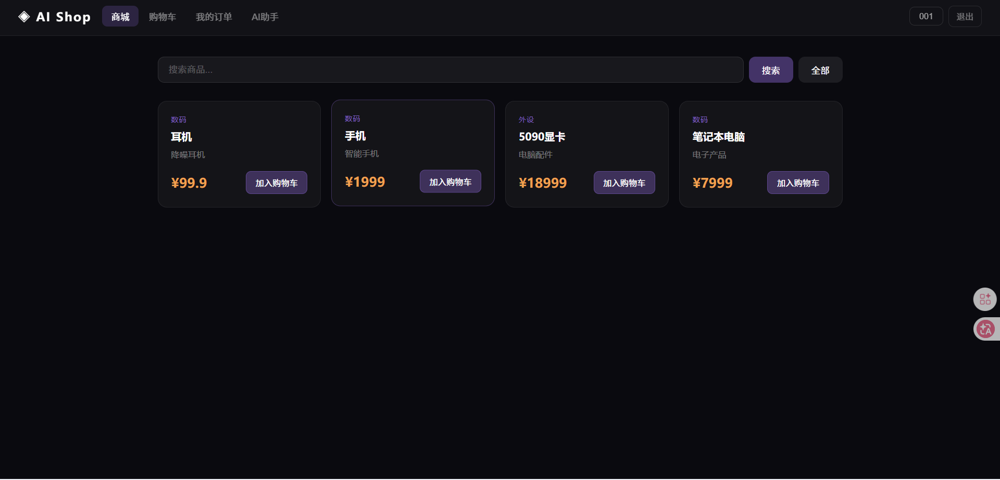

# 🛒 AI 智能电商平台
### 登录界面

### 管理员

### 普通用户

## 🌟 项目概述
这是一个 **全栈智能电商平台**，结合 **AI 技术**实现个性化商品推荐和智能问答 🤖。  
用户可以浏览商品 🏷️、管理购物车 🛍️、下单支付 💳，同时体验 AI 驱动的智能客服和个性化推荐。

## 🛠️ 技术栈
- **后端**: Python, FastAPI, SQLAlchemy, Pydantic, JWT, OAuth2  
- **前端**: Vue3, Vite, CSS  
- **数据库**: SQLite/MySQL  
- **AI 功能**: RAG 问答系统、个性化推荐算法  
- **工具**: Uvicorn, Git, GitHub

## ✨ 功能亮点
- **用户管理**: 注册 📝、登录 🔑、信息管理  
- **商品管理**: 浏览 🛒、分类 🔖、后台增删改查  
- **购物车 & 订单**: 加入购物车 🛍️、下单 🧾、支付 💳  
- **AI 应用**:  
  - 🤖 RAG 问答系统：智能客服、商品咨询  
  - 🎯 个性化推荐：基于用户行为数据，精准推荐商品  
- **安全 & 数据规范**: JWT 鉴权 🔒、Pydantic 数据校验 ✅

## 📁 项目结构
app/
├── api/ # API 路由：用户、商品、订单、AI、推荐
├── core/ # 核心逻辑：AI处理、RAG、推荐算法、JWT安全
├── db/ # 数据库连接
├── models/ # ORM 数据模型
├── schemas/ # 请求/响应数据校验
└── main.py # 项目入口
frontend/
├── src/
│ ├── components/ # Vue 页面组件
│ └── main.js # 前端入口
└── vite.config.js # 构建配置

## 🚀 安装与运行


### 后端
```bash
# 创建虚拟环境
python -m venv .venv
source .venv/bin/activate   # macOS/Linux
.venv\Scripts\activate      # Windows

# 安装依赖
pip install -r requirements.txt

# 启动后端服务
uvicorn app.main:app --reload
```

### 前端
```bash
# 进入前端目录
cd frontend

# 安装依赖
npm install

# 启动开发服务器
npm run dev
```

## 🎮 使用说明
1. 打开浏览器访问前端页面（默认 http://localhost:5173）  
2. 注册用户或登录管理员账号 🔑  
3. 浏览商品 🏷️、添加购物车 🛍️、下单 🧾  
4. 使用 AI 聊天功能 🤖 获取商品推荐和智能问答  

---

## 🌈 项目亮点
- AI 问答和推荐系统落地，实现智能购物体验 🎯  
- 前后端全栈开发，Vue3 SPA 与 FastAPI 高效协作 💻  
- 数据驱动推荐，采集用户行为提升个性化体验 📊  

---

## 👩‍💻 贡献者
- 项目开发者：你自己 👨‍💻  
- 前端界面设计：Claude AI 辅助生成 ✏️
---

